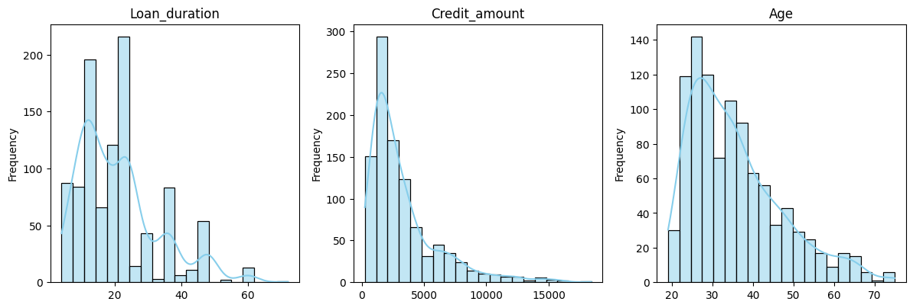
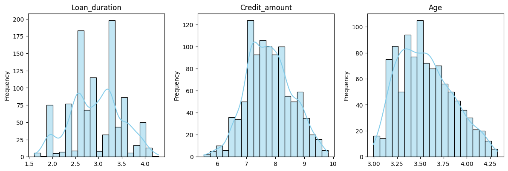
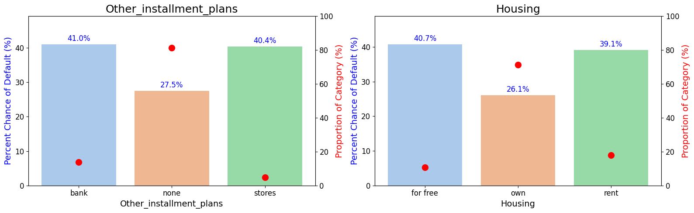
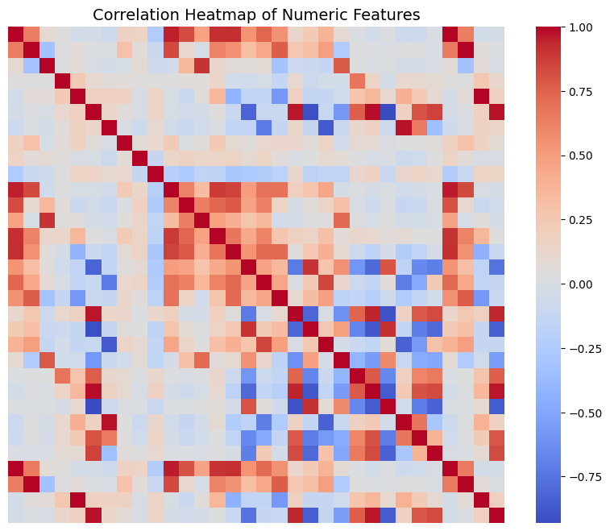
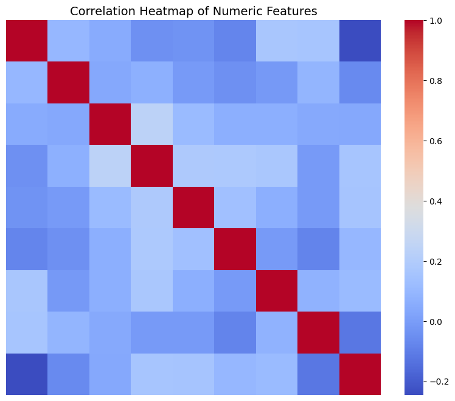
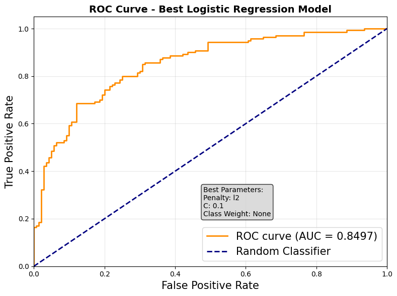
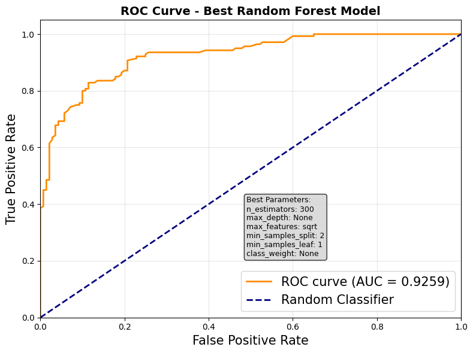
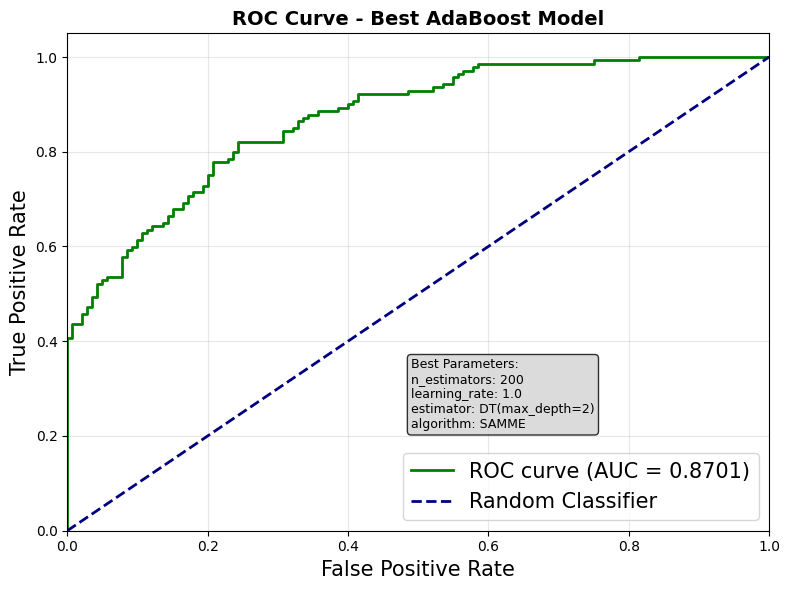
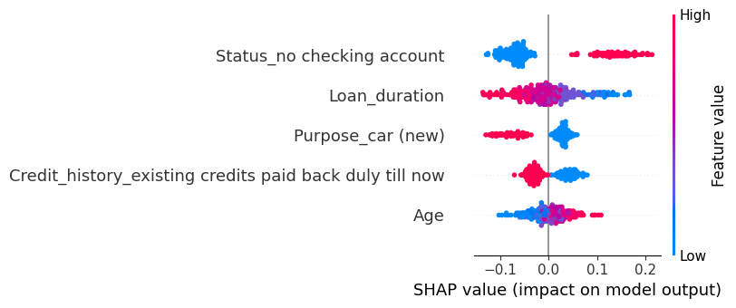

# Credit Risk Prediction using Machine Learning

## Overview
This project applies modern machine learning techniques to predict credit risk using the German Credit Dataset. It compares traditional statistical methods with advanced ensemble models, while emphasizing both predictive performance and model interpretability.

The study evaluates Logistic Regression, Random Forest, and AdaBoost, and uses SHAP to explain model predictions—bridging the gap between accuracy and transparency in financial decision-making.

---

## Objectives
- Compare predictive performance of:
  - Logistic Regression  
  - Random Forest  
  - AdaBoost  
- Improve model performance via:
  - Feature engineering  
  - Handling class imbalance (SMOTE)  
- Enhance interpretability using SHAP  
- Provide actionable business insights for lending  

---

## Dataset
- German Credit Dataset (UCI Machine Learning Repository)  
- 1000 observations, 20 features  

**Target distribution:**
- Good credit: 70%  
- Bad credit: 30%  

---

## Data Preprocessing

### Handling Skewed Distributions
Several numerical variables were highly skewed. Log transformations were applied to improve distribution symmetry and model performance.

<p align="center">
  
  
</p>

---

## Categorical Feature Analysis
Categorical variables were analyzed for imbalance and default risk. Rare categories with similar risk profiles were grouped to improve model stability.

<p align="center">
  
</p>

---

## Feature Engineering

### Techniques Used
- Interaction features (numerical × numerical)  
- Ratio features  
- Polynomial (squared) terms  

### Removing Multicollinearity
Highly correlated features were removed (threshold = 0.6), reducing features from 69 to 46.

<p align="center">
  
  
</p>

---

## Models and Methods

### Logistic Regression
- Regularization: L1, L2, Elastic Net  
- Hyperparameter tuning via GridSearchCV  
- ROC-AUC: 0.8497  

### Random Forest (Best Model)
- Tuned number of trees, depth, and features  
- ROC-AUC: 0.9259  

### AdaBoost
- Decision tree base learners  
- Tuned learning rate and estimators  
- ROC-AUC: 0.8701  

---

## Model Performance

The ROC curves below compare model performance.  
Random Forest achieves the strongest predictive performance.

<p align="center">
  
  
  
</p>

### Results Summary

| Model               | ROC-AUC | Precision | Recall |
|--------------------|--------|----------|--------|
| Logistic Regression | 0.8497 | 0.7603 | 0.7929 |
| Random Forest       | 0.9259 | 0.8769 | 0.8143 |
| AdaBoost            | 0.8701 | 0.7879 | 0.7429 |

---

## Model Explainability (SHAP)

To address the black-box nature of machine learning models, SHAP was used to interpret feature importance and understand predictions.

<p align="center">
  
</p>

### Key Insights
- Applicants without checking accounts show higher default risk  
- Loan duration is a strong driver of risk  
- Credit history is highly predictive of repayment behavior  
- Age shows non-linear effects in ensemble models  

---

## Business Recommendations
- Require stronger financial verification for applicants without bank accounts  
- Encourage shorter loan durations through incentives  
- Adjust interest rates based on loan duration risk  
- Use credit history for risk-based pricing  
- Monitor fairness in age-related predictions  

---

## Tech Stack
- Python  
- Scikit-learn  
- Pandas and NumPy  
- Matplotlib and Seaborn  
- SHAP  

---

## How to Run

```bash
git clone https://github.com/yourusername/your-repo-name.git
pip install -r requirements.txt
```

---

## Key Highlights
- End-to-end machine learning pipeline  
- Strong emphasis on interpretability  
- Real-world financial application  

---

## Future Improvements
- Implement gradient boosting models (XGBoost, LightGBM)  
- Deploy as a web application (Streamlit or Flask)  
- Conduct fairness and bias analysis  

---

## Author
Your Name
